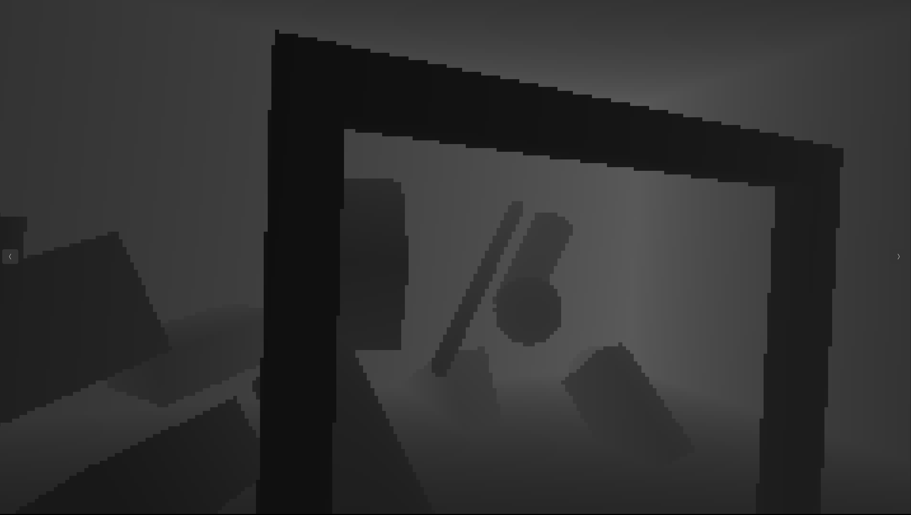
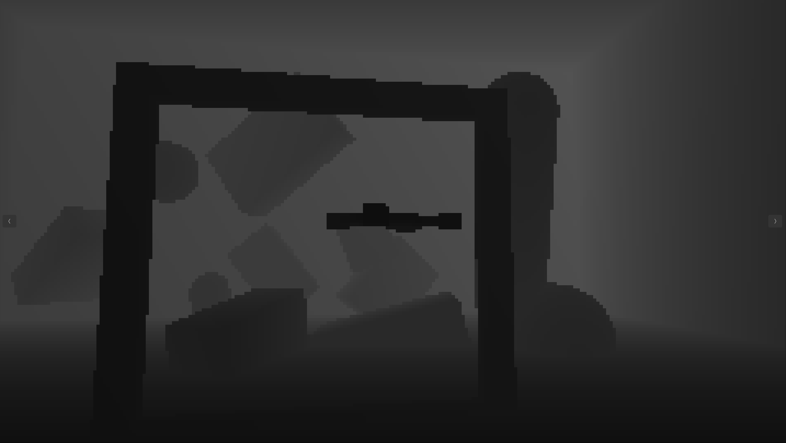
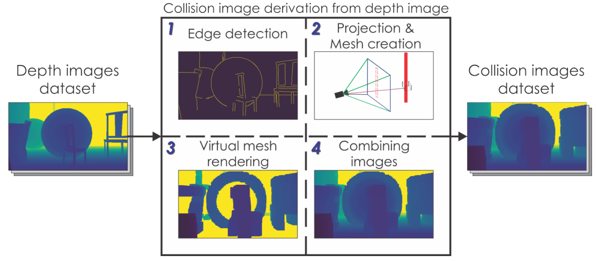
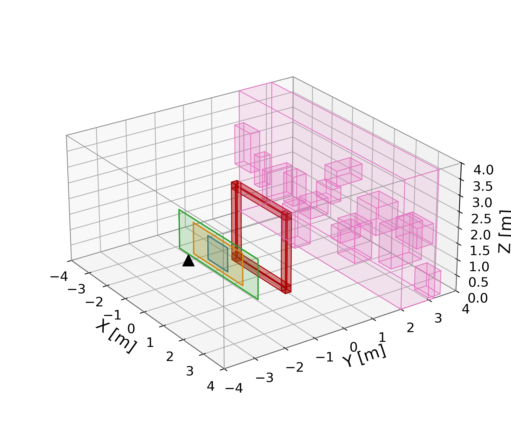

# Gate Navigation Task — End-to-End Guide

This document provides a complete technical walkthrough of the **gate navigation task** in the Aerial Gym Simulator: architecture, training, evaluation, configuration, and the full data flow from raw depth images to learned policies.

> **Thesis reference:** Z. Ruso, *"Reinforcement Learning for Cooperative Multi-View Depth-Based Perception in Autonomous UAV Navigation,"* MSc Thesis, University College London, September 2025.


---

## Overview

The gate navigation task trains a quadrotor equipped with **dual RGB-D cameras** (drone-mounted + static) to fly through a gate using deep reinforcement learning. The system uses:

- **Deep Collision Encoding (DCE)**: a pre-trained VAE compresses 270×480 depth images into compact 64D latent vectors
- **Gated Dual-Fusion Encoder**: learns to fuse drone camera + static camera latents with proprioceptive state
- **Sample Factory PPO**: high-throughput RL training across hundreds of parallel environments
- **Curriculum Learning**: progressively increases difficulty (noise, obstacles, spawn randomization)

```
┌─────────────────────────────────────────┐
│  Training / Inference Interface         │  aerial_gym/run.py, Makefile
├─────────────────────────────────────────┤
│  RL Algorithm (Sample Factory PPO)      │  train_aerialgym_custom_net_gate.py
├─────────────────────────────────────────┤
│  Environment Wrapper                    │  env_wrapper_gate.py
├─────────────────────────────────────────┤
│  Task + Curriculum + Rewards            │  NavigationTaskGate, CurriculumManager
├─────────────────────────────────────────┤
│  Physics + Rendering (Isaac Gym/Warp)   │  Parallelized simulation + sensors
└─────────────────────────────────────────┘
```


*Closed-loop RL stack: the simulator outputs depth images and state; the DCE encoder produces latents that, with proprioceptive state, feed PPO to yield velocity commands.*

---

## 0. Prerequisites & Setup

Before training the gate navigation task, ensure you have:

| Dependency | Version | Notes |
|------------|---------|-------|
| **NVIDIA GPU** | CUDA 11.7+ | Isaac Gym requires GPU for physics |
| **Conda** | any | Miniforge or Miniconda |
| **Isaac Gym** | Preview 4 | Manual download from [NVIDIA](https://developer.nvidia.com/isaac-gym) |
| **Sample Factory** | ≥2.0 | `pip install sample-factory` |
| **Python** | 3.8 | Pinned for Isaac Gym compatibility |
| **PyTorch** | 1.13.1 | With CUDA 11.7 (via conda) |

```bash
# Full setup
conda env create -f environment.yml
conda activate aerialgym
cd /path/to/isaacgym/python && pip install -e . && cd -
pip install sample-factory
pip install -e .

# Verify config loads
python -m aerial_gym.run --config configs/train_gate_sf.yaml --validate-only

# Dry run (shows the full command without executing)
python -m aerial_gym.run --config configs/train_gate_sf.yaml --dry-run
```

---

## 1. Observation Space (150D)

The agent receives a 150-dimensional observation vector every step, defined in `aerial_gym/task/schemas.py` via `GATE_OBS_LAYOUT`:

| Indices | Dim | Description |
|---------|-----|-------------|
| 0–2 | 3 | Drone position (world frame) |
| 3–5 | 3 | Static camera position (relative to drone) |
| 6–8 | 3 | Static camera orientation (relative to drone) |
| 9–11 | 3 | Drone orientation (roll, pitch, yaw) |
| 12–14 | 3 | Body-frame linear velocity |
| 15–17 | 3 | Body-frame angular velocity |
| 18–21 | 4 | Previous action |
| **22–85** | **64** | **Drone camera depth → VAE latent** |
| **86–149** | **64** | **Static camera depth → VAE latent** |

The 128 dimensions of VAE latents (64 per camera) are the core of Deep Collision Encoding — they compress spatial/depth information into a compact representation the policy can reason over.

## 2. Action Space (4D)

Continuous box `[-1, 1]⁴`, linearly scaled to physical setpoints:

| Dim | Control | Scaling |
|-----|---------|---------|
| 0 | X velocity (body) | v_x = 0.6 a_x  m/s |
| 1 | Y velocity (body) | v_y = 0.6 a_y  m/s |
| 2 | Z velocity (body) | v_z = 0.4 a_z  m/s |
| 3 | Yaw rate | psi_dot = 0.5 a_psi  rad/s |

Actions are sanitized (NaN to 0, clamped), scaled to body-frame velocity setpoints, and tracked by an SE(3) geometric velocity-yaw-rate controller running on-GPU. The controller computes desired thrust and torques via Lyapunov-stable attitude tracking (see Appendix D of the thesis for full derivation).

---

## 3. Deep Collision Encoding (VAE)

 
*Egocentric (drone) and exocentric (static) depth views — the two visual inputs fused by the policy.*

### Depth Sensor: Intel RealSense D455

Both the onboard (egocentric) and static (exocentric) cameras are modeled as D455 depth sensors with identical intrinsics:

| Parameter | Value |
|-----------|-------|
| Resolution | 480 x 270 (16:9) |
| Horizontal FOV | 87.0 deg |
| Vertical FOV | ~56.2 deg |
| Min depth | 0.4 m |
| Max depth | 20.0 m |
| Mounting (onboard) | Body-fixed, x-forward |
| Mounting (static) | World-fixed, behind gate at (0, -2.0, 1.5), facing +y |

Using identical sensor models across both viewpoints eliminates cross-calibration drift — differences between the two streams are attributable to viewpoint geometry, not device heterogeneity.

### Depth Normalization

Raw depth D (meters) is normalized to the unit interval before encoding:

```
D_norm = (clip(D, 0.4, 20.0) - 0.4) / 19.6
```

This ensures bounded inputs for the encoder and maps invalid/missing values to the far plane consistently.

### VAE Architecture

The VAE (`aerial_gym/utils/vae/VAE.py`) uses a ResNet8-based encoder-decoder:

```
Depth Image (1x270x480)
    -> Conv layers with skip connections
    -> Flatten -> Linear -> mu, log sigma^2   (each 64D)
    -> Reparameterize -> z (64D latent)
```

A single shared VAE is used for both camera streams. Sharing encoder weights across both cameras halves GPU memory and encourages a common geometric basis across viewpoints. The encoder is frozen during RL training — only the fusion encoder and policy are learned.

### Pre-trained Weights

```
aerial_gym/utils/vae/weights/ICRA_test_set_more_sim_data_kld_beta_3_LD_64_epoch_49.pth
```

Trained offline on depth images from a D455 camera with KL divergence weight beta=3 and latent dimension 64.

### Camera Processing Pipeline

`aerial_gym/task/navigation_task_gate/camera_observations.py` handles the full depth-to-latent pipeline:

```
Raw Depth (270x480)
  -> Depth normalization (clip + scale to [0,1])
  -> Curriculum-dependent Gaussian noise (sigma: 0.000625 -> 0.0125)
  -> Curriculum-dependent pixel dropout (rate: 0.000625 -> 0.0125)
  -> Frame dropout (blank: 0.025% -> 0.5%, freeze: 0.25% -> 5.0%)
  -> Clamp [0, 1]
  -> Frozen VAE Encoder
  -> 64D latent
```

Both the drone camera and static camera go through this pipeline independently, producing two 64D latent vectors per step. Noise and corruption are applied post-normalization to emulate real sensor artifacts (pixel dropout, additive Gaussian noise, frame freeze/blank) while maintaining geometric consistency.

---

## 4. Dual Fusion Encoder



`aerial_gym/rl_training/sample_factory/aerialgym_examples/dual_fusion_encoder.py`

The encoder fuses the two 64D camera latents with the 22D proprioceptive state before feeding into the policy network.

### Gated Fusion (default)

```
Drone Latents (64D) ──→ LayerNorm → Linear → ELU → z_ego (64D)
                                                          │
Static Latents (64D) ─→ LayerNorm → Linear → ELU → z_static (64D)
                                                          │
                         ┌────────────────────────────────┤
                         │  Concatenate [z_ego, z_static] │
                         │  → Gate Network → sigmoid(g)   │
                         └────────────────────────────────┘
                                      │
                    z_fused = g · z_ego + (1−g) · z_static   (64D)
```

When `gate_per_feature=True` (default), the gate is 64-dimensional (per-feature gating). Otherwise it's a single scalar gate.

### MLP Tail

```
[proprioception (22D), z_fused (64D)] → 86D
  → Linear(512) → ELU
  → Linear(256) → ELU
  → Linear(64) → ELU
  → encoder output (64D)
```

This feeds into a GRU (64 hidden units) then the policy/value heads.

---

## 5. Reward Structure

`aerial_gym/task/navigation_task_gate/reward_functions.py` — all reward functions are `@torch.jit.script` compiled.

### Dense Rewards (per step)

| Component | Description | Scale |
|-----------|-------------|-------|
| **Position** | Exponential decay with distance to gate | 0.5 |
| **Very close** | Bonus within 0.5m of gate | 0.75 |
| **Getting closer** | Shaped reward for decreasing distance; 2× penalty for moving away | 5.0 |
| **Gate approach** | Distance to gate center | 1.25 |
| **Gate alignment** | Body-frame alignment toward gate | 0.5 |
| **Action smoothness** | Penalizes large Δ from previous action (per axis) | varies |
| **Action magnitude** | Penalizes large absolute actions | varies |
| **Time penalty** | Per-step cost scaled by episode progress | negative |
| **Static FOV visibility** | Bonus when drone is in static camera's FOV | curriculum-scaled |

### Sparse Rewards (one-time)

| Component | Value | Trigger |
|-----------|-------|---------|
| **Gate passage** | +100 | Crossing gate plane correctly |
| **Collision** | −100 | Any collision (episode terminates) |
| **Boundary violation** | −5 to −10 | Crossing gate plane outside passage window |
| **Timeout** | −10 | Episode time limit reached |

All rewards are scaled by a curriculum multiplier: `1.0` at level 3, rising to `~1.5` at level 23.

---

## 6. Curriculum Learning

`aerial_gym/task/navigation_task_gate/curriculum_management.py`

The curriculum stages difficulty along multiple independent axes. Training uses levels 3-23; levels 23-33 are reserved for evaluation to assess zero-shot generalization beyond the training envelope.

### Curriculum Controller

| Parameter | Value |
|-----------|-------|
| Level range | L in [3, 23] (training), up to 33 (evaluation) |
| Evaluation window | 256 episodes (success / crash / timeout) |
| Increase threshold | Success rate > 0.60 (step +1) |
| Decrease threshold | Success rate < 0.25 (step -1) |
| Cooldown | 12 windows after a level change |
| Forced-level option | Available (freezes progression for evaluation) |

### Visual Randomization (depth sensing, both cameras)

| Aspect | Target | Schedule | Value @ L=3 | Value @ L=23 |
|--------|--------|----------|-------------|--------------|
| Gaussian depth noise sigma | Drone + Static | Linear 3->23 | 0.000625 | 0.0125 |
| Per-pixel dropout p | Drone + Static | Linear 3->23 | 0.000625 | 0.0125 |
| Whole-frame freeze p | Drone | Linear 3->23 | 0.25% | 5.0% |
| Whole-frame blank p | Drone | Linear 3->23 | 0.025% | 0.5% |
| Whole-frame freeze p | Static | Linear 3->23 | 0.25% | 5.0% |
| Whole-frame blank p | Static | Linear 3->23 | 0.025% | 0.5% |
| Exocentric camera azimuth | About gate centre | Linear 3->23 | +/-3 deg | +/-19 deg |

### State/Pose Observation Noise

| Component | Schedule | Value @ L=3 | Value @ L=23 | Units |
|-----------|----------|-------------|--------------|-------|
| Drone position | Linear 3->23 | 0.001 | 0.02 | m (per-axis std) |
| Drone orientation | Linear 3->23 | 0.025 | 0.5 | deg (per-axis std) |
| Static camera position | Linear 3->23 | 0.0025 | 0.05 | m (per-axis std) |
| Static camera orientation | Linear 3->23 | 0.05 | 1.0 | deg (per-axis std) |

### Scene & Geometry

| Component | Schedule | Value @ L=3 | Value @ L=23 |
|-----------|----------|-------------|--------------|
| Obstacles behind gate | Direct mapping | 3 | 23 (clamped by asset capacity 30) |
| Gate size unlocking | Linear threshold | >=80% scale | >=40% scale |

### Spawn Variation (robot reset)

| Component | Schedule | Value @ L=3 | Value @ L=23 | Units |
|-----------|----------|-------------|--------------|-------|
| Lateral half-span (X) | Linear 3->23 | +/-0.50 | +/-2.00 | m |
| Longitudinal center (Y) | Constant | -1.50 | -1.50 | m |
| Vertical center (Z) | Constant | 1.125 | 1.125 | m |
| Vertical half-span (Z) | Linear 3->23 | +/-0.375 | +/-0.625 | m |
| Yaw range at reset | Linear 3->23 | 2 deg | 45 deg | deg |

---

## 7. Configuration System

### Pydantic Schema

`aerial_gym/config/run_config.py` defines a validated config hierarchy:

```python
RunConfig
├── mode: train | eval | play | inference_suite
├── common: task, num_envs, device, seed, headless
├── training: total_steps, batch_size, learning_rate, gamma
├── sample_factory: fusion, encoder_mlp_layers, rnn_size, ppo_clip_ratio
├── curriculum: min_level, max_level, force_level
├── camera: static_camera_base_y/z, yaw_sweep, arc_follow
├── wandb: enabled, project, tags
├── ablation: observation/reward ablation flags
└── eval: checkpoint, num_episodes
```

### YAML Config Files

Located in `configs/`:

**Training:**
- `train_gate_sf.yaml` — default 256-env gate training
- `train_gate_sf_fixed_orient.yaml` — fixed drone orientation
- `train_gate_sf_arc_follow.yaml` — arc-follow static camera
- `train_gate_sf_dynamic_follow.yaml` — dynamic camera

**Evaluation:**
- `eval_gate_drone_only.yaml` — ablation: no static camera
- `eval_gate_all_modalities.yaml` — all modalities × seeds × levels
- `eval_gate_sweeping.yaml`, `eval_gate_locked_yaw.yaml`, etc.

### CLI Overrides

```bash
python -m aerial_gym.run --config configs/train_gate_sf.yaml \
  --set common.num_envs=512 training.learning_rate=0.0001
```

---

## 8. Training

### Quick Start

```bash
# Validate config
make validate-config CONFIG=configs/train_gate_sf.yaml

# Train (default: 256 envs, ~1.2M steps, gated fusion)
make train-gate

# Or with custom overrides
python -m aerial_gym.run --config configs/train_gate_sf.yaml \
  --set common.num_envs=512 \
       training.total_steps=2_000_000 \
       wandb.enabled=true \
  --log
```

### Makefile Targets

| Command | Description |
|---------|-------------|
| `make train-gate` | Default gate training |
| `make train-gate-fixed` | Fixed orientation variant |
| `make train-gate-arc` | Arc-follow camera variant |
| `make train-gate-dynamic` | Dynamic follow camera variant |
| `make eval` | Generic evaluation |
| `make eval-all-modalities` | Full ablation suite |
| `make validate-config CONFIG=<yaml>` | Validate config only |
| `make dry-run CONFIG=<yaml>` | Show command without running |

### Default Hyperparameters

| Parameter | Value |
|-----------|-------|
| Parallel environments | 256 |
| Batch size | 8192 |
| Learning rate | 3×10⁻⁴ |
| Discount (γ) | 0.98 |
| GAE (λ) | 0.95 |
| PPO clip ratio | 0.2 |
| Rollout horizon | 32 |
| RNN | GRU, 64 hidden units |
| Encoder MLP | [512, 256, 64] |
| Fusion | Gated, per-feature |
| Total steps | ~1.2M |

### Training Outputs

```
train_dir/<experiment_name>/
├── checkpoint_p0/
│   ├── <experiment>_best_<step>_<frames>_reward_<R>.pth
│   └── <experiment>_<step>_<frames>.pth
├── curriculum_<timestamp>.log
└── logs/
```

### Training Data Flow

```
YAML Config → RunConfig (validated) → Environment Variables
    → Sample Factory launches N worker processes
    → Each worker:
        NavigationTaskGate.reset()
          → Spawn drone at curriculum-dependent position
          → Render dual cameras → VAE encode → 64D + 64D
          → Build 150D observation

        NavigationTaskGate.step(action)
          → Velocity controller applies action
          → Isaac Gym physics (10 substeps)
          → Re-render cameras → VAE encode
          → Compute 14 reward components
          → Check termination (collision / passage / timeout)
          → Curriculum update if episode ends

    → PPO collects rollouts → compute GAE advantages → gradient update
    → Repeat until total_steps reached
```

---

## 9. Evaluation & Inference

### Using the Unified Runner

```bash
python -m aerial_gym.run --config configs/eval_gate_all_modalities.yaml \
  --set eval.checkpoint="./train_dir/.../checkpoint_p0/best_*.pth" \
  --log
```

### Using enjoy_aerialgym.py Directly

```bash
python aerial_gym/rl_training/sample_factory/aerialgym_examples/enjoy_aerialgym.py \
  --train_dir=./train_dir/<experiment>/ \
  --experiment=<experiment_name> \
  --env=quad_with_obstacles_gate \
  --max_num_episodes=10 \
  --eval_deterministic=true \
  --save_gifs=true
```

### Programmatic Inference

```python
from aerial_gym.examples.dce_rl_navigation.sf_inference_class_gate import NN_Inference_Class_Gate

model = NN_Inference_Class_Gate(
    num_envs=256, num_actions=4, num_obs=150, cfg=cfg
)
actions, values = model(obs_dict, rnn_states)
```

### GIF Recording

Set `--save_gifs=true` during evaluation. Episodes are saved to `./gif_episodes/` with dual-camera views (drone depth + static depth).

---

## 10. Environment & Physics Specification


*3D overview: red frame — gate; black triangle — exocentric camera; colored panels — drone spawn zones across curriculum levels; purple cubes — obstacle region.*

### Workspace & Gate Geometry

| Parameter | Symbol | Value | Notes |
|-----------|--------|-------|-------|
| Workspace bounds | [x,y,z] | [-4,+4] x [-4,+4] x [0,+4] m | Axis-aligned box |
| Gate plane | Pi, n | y = 0, n = +y_hat | Center at origin |
| Aperture size (100% scale) | w x h | ~2.5 m x ~2.3 m | Scales nonlinearly with difficulty |
| Gate center height (100% scale) | z_gate | ~1.2 m | Adaptive to gate scale |
| Approach region | y | [-4.0, 0.0) m | Spawn region |
| Front region | y | (+2.0, +4.0] m | Egress region |
| Frames | W / B | W: right-handed z-up; B: x-fwd, y-left, z-up | Control in body frame |

The world origin is placed at the gate plane so the passage condition is reference-free: a valid passage occurs when (i) the sign of (p - p_gate) dot n transitions from negative to positive, and (ii) the lateral position lies within the rectangular aperture.

**Centerline offset** at crossing: rho = sqrt((x - x_gate)^2 + (z - z_gate)^2). This scalar summarizes traversal quality — lower is more centered.

### Parallelization

Training uses 128 environments tiled in a grid on a single GPU. Each environment occupies an identical 8x8x4m cell separated by opaque chamber walls that prevent cross-arena sensing, rendering, and physics interactions.

### Robot Platform: X500 Quadrotor

| Category | Parameter | Value | Notes |
|----------|-----------|-------|-------|
| **Disturbances** | Enabled | True | Domain robustness |
| | Probability | 0.05 | Per step-wise Bernoulli trigger |
| | Max force/torque | [4.75, 4.75, 4.75] N, [0.03, 0.03, 0.03] Nm | Bounded wrench |
| | Damping (lin/ang) | 0.02 / 0.02 | Asset-level |
| **Physics** | Collapse fixed joints | True | Fewer links, more stable |
| | Fix base link | False | Free-flying |
| | Max lin/ang vel | 100.0 / 100.0 | Hard safety caps |
| **Motor model** | Thrust coeff k_f | 8.54858e-6 N/(rps)^2 | Quadratic thrust |
| | Yaw torque coeff c_tau | 0.025 | Reaction torque |
| | Time constant (spin-up) | 0.0125 s | Asymmetric response |
| | Time constant (spin-down) | 0.025 s | Slower deceleration |
| | Thrust limits per motor | [0.1, 20.0] N | With slew rate limit |
| **Controller** | Type | SE(3) velocity-yaw-rate | Geometric controller |
| | Velocity limits | [0.6, 0.6, 0.4] m/s | Body-frame x,y,z |
| | Yaw rate limit | 0.5 rad/s | |

### Exocentric Camera Modes

Six camera behaviors span the principal axes along which the static viewpoint affects policy learning. All other training factors (architecture, rewards, curriculum) remain fixed across modes.

| Mode | Origin | Orientation | Curriculum-sensitive? | Description |
|------|--------|-------------|----------------------|-------------|
| **FixedYaw** | Fixed behind gate | Randomized yaw per episode | Yes (yaw range +/-3 to +/-19 deg) | Gate-centric baseline; per-episode yaw prevents overfitting |
| **YawSweep** | Fixed behind gate | Sinusoidal sweep | Yes (amplitude grows with level) | Rotational feature drift; stresses fusion under view changes |
| **LockedFollow** | Fixed behind gate | Tracks drone continuously | No | Isolates orientation effects without parallax |
| **DynFollow** | Trails drone (-2m Y offset) | Looks at drone, biases toward gate when gate exits FOV | No | Vehicle-centric view with minimal gate awareness |
| **ArcFollow** | Circular arc around gate (R=2m) | Looks at drone with gate bias (w=0.3) | No | Controlled lateral parallax from moving origin |
| **DroneOnly** | N/A | N/A | N/A | Static stream ablated; lower-bounds performance without exocentric context |

### Gate Passage Detection

`aerial_gym/task/navigation_task_gate/gate_geometry.py` handles passage logic:
- Tracks drone position relative to gate plane (Pi at y=0)
- Detects plane crossing via sign change of (p - p_gate) dot n from negative to positive
- Verifies passage point lies within the rectangular aperture (with tolerance epsilon)
- Awards one-time passage reward on success

---

## 11. File Index

### Core Task
| File | Purpose |
|------|---------|
| `aerial_gym/task/navigation_task_gate/navigation_task_gate.py` | Main task class |
| `aerial_gym/task/navigation_task_gate/reward_functions.py` | JIT-compiled reward components |
| `aerial_gym/task/navigation_task_gate/reward_helpers.py` | Reward computation helpers |
| `aerial_gym/task/navigation_task_gate/obs_reward_helpers.py` | Observation + reward processing |
| `aerial_gym/task/navigation_task_gate/curriculum_management.py` | Dynamic difficulty |
| `aerial_gym/task/navigation_task_gate/curriculum_data.py` | Curriculum schedule data |
| `aerial_gym/task/navigation_task_gate/camera_observations.py` | Camera noise + VAE encoding |
| `aerial_gym/task/navigation_task_gate/gate_geometry.py` | Gate detection + passage logic |
| `aerial_gym/task/navigation_task_gate/init_helpers.py` | Task initialization |
| `aerial_gym/task/navigation_task_gate/step_helpers.py` | Per-step logic |
| `aerial_gym/task/schemas.py` | 150D observation layout |

### Training Pipeline
| File | Purpose |
|------|---------|
| `aerial_gym/run.py` | Unified CLI entry point |
| `aerial_gym/config/run_config.py` | Pydantic config schema |
| `aerial_gym/rl_training/sample_factory/aerialgym_examples/train_aerialgym_custom_net_gate.py` | Training script |
| `aerial_gym/rl_training/sample_factory/aerialgym_examples/env_wrapper_gate.py` | Sample Factory wrapper |
| `aerial_gym/rl_training/sample_factory/aerialgym_examples/dual_fusion_encoder.py` | Gated/concat fusion encoder |
| `aerial_gym/rl_training/sample_factory/aerialgym_examples/task_registration.py` | Task registration |
| `aerial_gym/rl_training/sample_factory/aerialgym_examples/cfg_env_bridge.py` | Config→env var bridge |

### VAE
| File | Purpose |
|------|---------|
| `aerial_gym/utils/vae/VAE.py` | ResNet8 encoder/decoder |
| `aerial_gym/utils/vae/vae_image_encoder.py` | Wrapper for RL integration |
| `aerial_gym/utils/vae/weights/ICRA_...epoch_49.pth` | Pre-trained weights (43.8 MB) |

### Inference
| File | Purpose |
|------|---------|
| `aerial_gym/examples/dce_rl_navigation/sf_inference_class_gate.py` | Policy loading + execution |
| `aerial_gym/examples/dce_rl_navigation/episode_metrics.py` | Trajectory tracking |
| `aerial_gym/examples/dce_rl_navigation/gif_recorder.py` | Episode visualization |

### Config
| File | Purpose |
|------|---------|
| `configs/train_gate_sf.yaml` | Default training config |
| `configs/eval_gate_*.yaml` | Evaluation configs |
| `aerial_gym/config/task_config/navigation_task_config_gate.py` | Task parameters |
| `aerial_gym/config/task_config/curriculum_schedules.py` | Curriculum progression |
| `aerial_gym/config/env_config/gate_env.py` | Gate environment assets |

### Shipped Model Weights

Only two weight files are tracked in the repository:

```
aerial_gym/utils/vae/weights/ICRA_test_set_more_sim_data_kld_beta_3_LD_64_epoch_49.pth   (43.8 MB, VAE)
aerial_gym/examples/dce_rl_navigation/TRAINED/.../HIGH_CONFIG_16ENV_2_best_..._reward_1463.917.pth  (DCE checkpoint)
```

All other training outputs (checkpoints, GIFs, logs) are gitignored and regenerated by running training.

---

## 12. Research Context & Experimental Design

This codebase implements the experiments described in the MSc thesis. This section summarizes the research questions, methodology, and evaluation protocol for reproducibility.

### Research Questions

- **RQ1:** Does incorporating an external second viewpoint improve navigation success rates compared to a single-camera agent?
- **RQ2:** How does a multi-view policy affect navigation efficiency (time-to-goal, path length) and geometric accuracy at gate crossing?
- **RQ3:** How do performance and robustness vary with the external camera's pose and behavior (static fixed, sweeping, target-following)?
- **RQ4:** Under camera-stream isolation or failure, is exocentric-only control sufficient, and how does dual-view fusion degrade compared to single-view alternatives?

### Experimental Design

| Factor | Options | Status | Baseline |
|--------|---------|--------|----------|
| Camera behavior (exocentric) | FixedYaw, YawSweep, LockedFollow, DynFollow, ArcFollow, DroneOnly | **Varied (V)** | DroneOnly |
| Camera asymmetry (noise/dropout) | Drone>Static, Static>Drone, Symmetric | Eval only (E) | Symmetric |
| Fusion strategy | Gated late fusion | Fixed (F) | Gated |
| Gate granularity | Per-feature 64D, Scalar 1D | Fixed (F) | 64D per-feature |
| Depth corruptions | Gaussian, pixel dropout, frame freeze/blank | Fixed + E panels | Curriculum-scheduled |
| Observation ablations | Vision-only, drone-only, static-only | V/E | Vision-only |
| Scene geometry | Gate aperture + clutter schedule | Fixed (F) | Curriculum-scheduled |
| Spawn distribution | Randomized pos/yaw | Fixed (F) | Randomized |
| Curriculum controls | Promotion on; forced-level | Fixed + E forced | Promotion on |

**Status codes:** V = varied in training, E = evaluation-only stress test, F = fixed/invariant.

### Training Methodology

- **Budget:** 2.01M frames per configuration, 128 synchronous environments
- **Seeds:** Single training seed per camera configuration (6 configs total); 5 independent evaluation seeds
- **Curriculum:** No-decrease policy. Training starts at level 13 and promotes to level 23 on success. Levels 23-33 are reserved for evaluation stretch
- **Determinism:** GPU model/driver/CUDA/cuDNN pinned; deterministic kernels; cuDNN benchmarking and TF32 disabled; CUBLAS_WORKSPACE_CONFIG=:16:8; all RNG seeds fixed

### Evaluation Protocol

- **Fixed-level evaluation** (no curriculum progression) for clean attribution to difficulty
- **Levels tested:** 3 (unseen easier), 13, 23 (training range), 33 (unseen harder, zero-shot generalization)
- **Per condition:** 512 episodes per seed, 5 seeds, deterministic action selection, frozen normalization
- **Stream ablations:** Both cameras (full), Drone-only (obs[86:150] zeroed), Static-only (obs[22:86] zeroed), Vision-off (both zeroed, negative control)
- **Warm-up:** First few episodes excluded to let RNN hidden states stabilize

### Key Metrics

| Metric | Definition |
|--------|-----------|
| Gate-passage success rate | Boolean passage event per episode |
| Target passage rate | Passage within +/-10% of gate width and height from center |
| Time-to-gate | Steps (seconds via simulator step rate) |
| Path efficiency | Straight-line distance / realized path distance |
| Centerline offset rho | sqrt((x-x_gate)^2 + (z-z_gate)^2) at crossing |
| Fusion gate activation | Mean/std of sigmoid gate values across features and time |
| Gradient attribution shares | Mean gradient magnitude per observation slice (state / egocentric / exocentric) |

---

## 13. Detailed Documentation

For deeper technical detail on individual subsystems, see these companion documents:

| Document | Content |
|----------|---------|
| [Environment Specification](docs/gate_navigation_thesis/environment_specification.md) | Simulator stack, workspace geometry, coordinate frames, assets, parallelization, determinism |
| [Robot Platform & Control](docs/gate_navigation_thesis/robot_platform.md) | X500 quadrotor specs, motor model, SE(3) controller, wrench allocation, spawn states |
| [Visual Pipeline & Fusion](docs/gate_navigation_thesis/visual_pipeline.md) | VAE architecture, depth preprocessing, gated/concat fusion, MLP+GRU encoder, parameter counts |
| [Reward Shaping](docs/gate_navigation_thesis/reward_shaping.md) | All reward components with equations, parameters, design rationale, scaling rules |
| [Curriculum Learning](docs/gate_navigation_thesis/curriculum.md) | Full curriculum tables, progression rules, domain randomization schedules, ablation toggles |
| [Camera Modes](docs/gate_navigation_thesis/camera_modes.md) | All 6 exocentric camera modes with equations, fusion regimes, configuration |
| [Experimental Methodology](docs/gate_navigation_thesis/methodology.md) | Research questions, experimental design, training/eval protocol, PPO config, metrics, reproducibility |
| [Results Summary](docs/gate_navigation_thesis/results_summary.md) | Key findings per research question, camera mode comparison, ablation results, fusion behavior |
| [Sim-to-Real Transfer](docs/gate_navigation_thesis/sim2real.md) | Hardware platform, deployment architecture, ROS node, PX4 integration, transfer strategies |
| [Future Work](docs/gate_navigation_thesis/future_work.md) | Sim-to-real, architectural extensions, multi-agent swarm, dynamic obstacles, edge deployment |

---

## 14. References

- **Thesis:** Z. Ruso, "Reinforcement Learning for Cooperative Multi-View Depth-Based Perception in Autonomous UAV Navigation," MSc Thesis, University College London, September 2025
- **Aerial Gym Simulator:** Kulkarni, Rehberg & Alexis, "Aerial Gym Simulator: A Framework for Highly Parallelized Simulation of Aerial Robots," IEEE RA-L 2025 — [arxiv.org/abs/2305.16510](https://arxiv.org/abs/2305.16510)
- **DCE RL Navigation (ICRA 2024):** Kulkarni & Alexis, "Reinforcement Learning for Collision-free Flight Exploiting Deep Collision Encoding"
- **PPO:** Schulman et al., "Proximal Policy Optimization Algorithms," 2017
- **Gated Multimodal Units:** Arevalo et al., "Gated Multimodal Units for Information Fusion," ICLR Workshop 2017
- **Sample Factory:** [github.com/alex-petrenko/sample-factory](https://github.com/alex-petrenko/sample-factory)
- **NVIDIA Isaac Gym:** [developer.nvidia.com/isaac-gym](https://developer.nvidia.com/isaac-gym)
