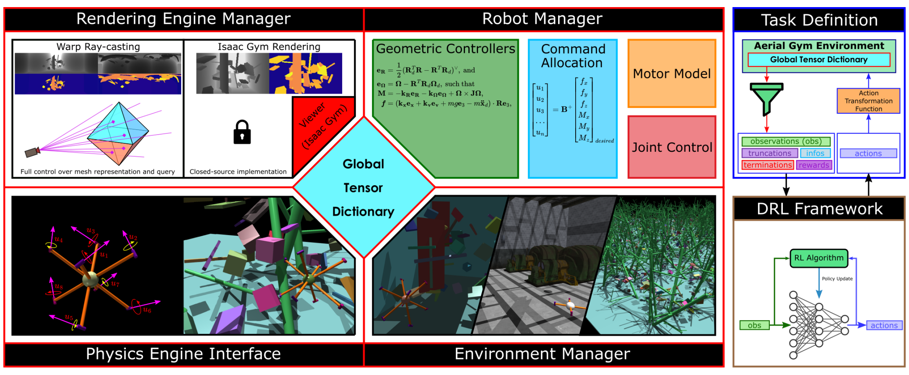
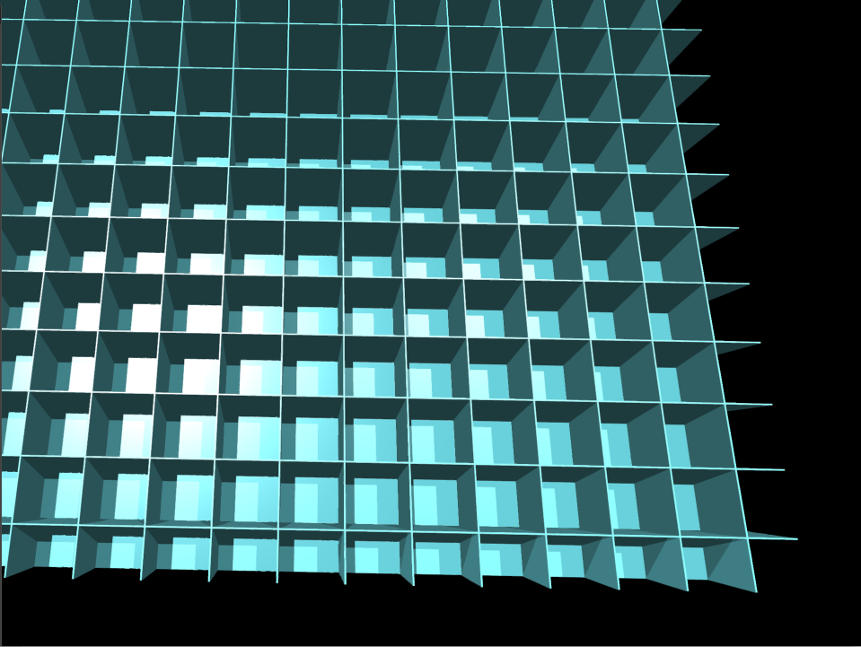
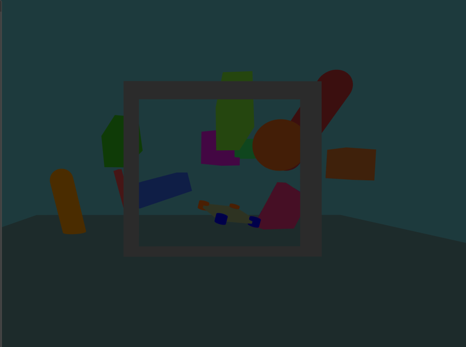
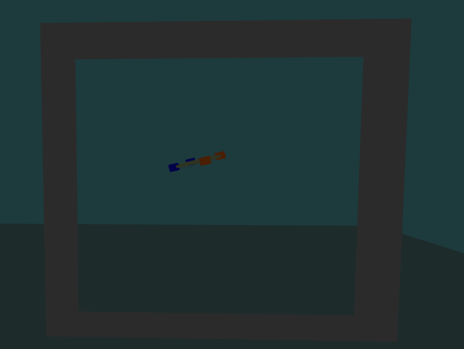

# Environment & Simulation Specification

> Detailed specification from Chapter 3 of: Z. Ruso, *"Reinforcement Learning for Cooperative Multi-View Depth-Based Perception in Autonomous UAV Navigation,"* MSc Thesis, UCL, 2025.


*Figure 3.1: System overview — rendering, physics, robot, and environment managers exchange data via a Global Tensor Dictionary; the task layer composes observations, rewards, and terminations.*

## Simulator Stack

The simulator is built on **NVIDIA Isaac Gym** and orchestrated through **Aerial Gym** to execute batched, vectorized environments on a single CUDA device. The entire control loop operates with GPU-native tensors for observations, actions, rewards, and terminations, minimizing host-device transfers.

A **global tensor dictionary** serves as the sole conduit for shared state across rendering, physics, robot, and environment managers. This centralizes authoritative scalars and tensors (e.g., curriculum flags, camera modes) that downstream components consume without additional synchronization.

### Key Design Decisions

| Decision | Rationale | Consequence |
|----------|-----------|-------------|
| Fixed-step physics (1:N control:physics) | Contact stability while maintaining control cadence | Deterministic rollouts at the step level |
| Synchronous lockstep stepping | Avoids stragglers and timing skew | Wall-clock throughput increases without on-policy violations |
| In-batch episode resets | No teardown of global simulator state | Constant-time resets even at high env counts |
| Rigid contact solver with tuned friction/restitution | Prevents tunneling and excessive restitution | Stable gate/ground interactions across curriculum levels |
| NaN/Inf guards on state and actuation | Prevents propagation of corrupt values | Clean episode termination under adverse exploration |
| Quaternion orientation parameterization | Avoids gimbal lock singularities | Reduced numerical drift in attitude representation |

## Workspace Geometry

### Dimensions

| Parameter | Symbol | Value | Notes |
|-----------|--------|-------|-------|
| Workspace bounds | [x,y,z] | [-4, +4] x [-4, +4] x [0, +4] m | Axis-aligned box, 8x8x4 m |
| Gate plane | Pi, n | y = 0, normal n = +y | Center at world origin |
| Aperture (100% scale) | w x h | ~2.5 m x ~2.3 m | Scales nonlinearly with difficulty |
| Gate center height | z_gate | ~1.2 m (100% scale) | Adaptive to gate scale |

### Spatial Regions

Space along y is segmented into three regions:

| Region | Y range | Purpose |
|--------|---------|---------|
| Approach | [-4.0, 0.0) m | Drone spawn zone |
| Gate corridor | Thin slab around y = 0 | Passage detection zone |
| Front | (+2.0, +4.0] m | Egress zone; obstacles placed here |

### Coordinate Frames

| Frame | Convention | Usage |
|-------|-----------|-------|
| World (W) | Right-handed, z-up, meters/radians/seconds | Asset placement, metrics, logging |
| Body (B) | x-forward, y-left, z-up | Commanded velocities, angular rates |

Homogeneous transforms T = (R, t) map vectors between frames: p_W = R_WB * p_B + t_W. Frame indices annotate direction explicitly (e.g., R_WB rotates body to world).

## Gate Passage Detection

The gate plane Pi is defined as the plane with normal n = +y passing through the gate center at y = 0.

**Valid passage** occurs when:
1. The sign of (p_W - p_gate) dot n transitions from **negative to positive** (drone crosses from approach to front side)
2. The lateral position lies within the rectangular aperture (with tolerance epsilon)

**Centerline offset** at crossing:

```
rho = sqrt((x_t - x_gate)^2 + (z_t - z_gate)^2)
```

This scalar summarizes traversal quality — lower values indicate more centered passage.

## Parallelization


*Figure 3.3: Vectorized simulation layout — tiled arena grid enabling 128 independent environments (top-down view).*

Training uses **128 environments** tiled in a grid on a single GPU. Each environment occupies an identical 8x8x4 m cell separated by opaque chamber walls that serve three purposes:

1. Prevent the static camera from "seeing" neighboring arenas (consistent depth histograms)
2. Bound line-of-sight to prevent far-plane saturation and cross-scene clutter corruption
3. Improve determinism and batched throughput by limiting ray casts and contacts to local geometry

 
*Figure 3.4: Gate-navigation environment — front view (left) and oblique view (right).*

## Asset Catalogue

| Asset class | Mobility | Collider | Semantics | Notes |
|-------------|----------|----------|-----------|-------|
| Gate frame | Static | Primitives | Yes | Rectangular aperture |
| Obstacles | Static | Primitives | Yes | Front-of-gate region only |
| Ground plane | Static | Slab (t_min > 0) | Yes | z = 0 |
| Boundary walls | Static | Slabs | Yes | Enclose workspace |

### Obstacle Families

Limited to static (kinematic) panels, cuboids, cylinders, and simple trapezoids. This preserves well-posed rigid-body dynamics while inducing occlusions and collision risk along the approach corridor. Geometry is randomized (varying gate-frame sizes, 10+ obstacle shapes) for sim-to-real transfer.

### Asset Engineering

- Collision and visual geometry reuse the same primitive shapes (no separate decimation pipeline)
- Ground and walls use engine default friction and restitution
- Instances are preloaded and reused across vectorized environments at fixed per-scene capacity
- Placement uses bounds checks; obstacles are confined to the front-of-gate region
- Meshes are normalized to z-up on import

## Determinism

Determinism is enforced through:
- Fixed seeds for evaluation
- Fixed-step integration
- Avoidance of non-deterministic GPU kernels where alternatives exist
- Quaternion orientation parameterization
- Conservative solver tolerances and substepping

**Limitation:** The environment assumes rigid-body dynamics and does not capture aeroelastic effects. Obstacles are static; no dynamic moving objects are modeled.
