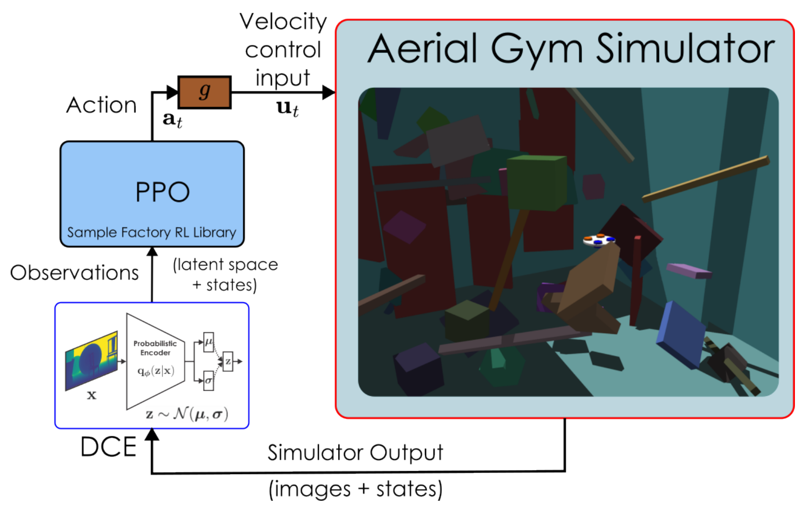
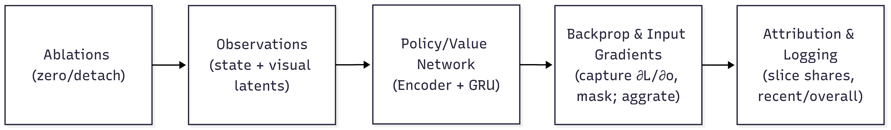

# Experimental Methodology

> Detailed specification from Chapter 5 of: Z. Ruso, *"Reinforcement Learning for Cooperative Multi-View Depth-Based Perception in Autonomous UAV Navigation,"* MSc Thesis, UCL, 2025.

*Figure 4.1: Closed-loop RL stack — the simulator outputs images and state; the DCE encoder produces latents that, with state, feed PPO to yield actions; a velocity controller maps actions to control inputs.*

*Figure 5.1: Saliency-based gradient attribution pipeline — capture input gradients at the encoder, mask and aggregate per feature, log slice shares (state, egocentric, exocentric).*

## Research Questions

| ID | Question | Hypothesis |
|----|----------|-----------|
| **RQ1** | Does incorporating an external second viewpoint improve navigation success rates compared to a single-camera agent? | Multi-view cooperation yields higher gate traversal success and fewer collisions, especially under occlusions |
| **RQ2** | How does a multi-view policy affect navigation efficiency and geometric accuracy at gate crossing? | Multi-view improves accuracy of gate traversal vs. egocentric only |
| **RQ3** | How do performance and robustness vary with the external camera's pose and behavior (static, sweeping, following)? | Stable, goal-centering viewpoints outperform large/rapid sweeps or randomized placement |
| **RQ4** | Under camera-stream isolation or failure, is exocentric-only control sufficient? How does dual-view fusion degrade? | Exocentric-only is feasible but dual fusion outperforms on reliability and last-meter precision; degrades gracefully under asymmetric failure |

## Experimental Design Matrix

| Factor | Options | Status | Baseline |
|--------|---------|--------|----------|
| **Camera behavior (exocentric)** | FixedYaw, YawSweep, LockedFollow, DynFollow, ArcFollow, DroneOnly | **V** | DroneOnly |
| Camera asymmetry (noise/dropout) | Drone>Static, Static>Drone, Symmetric | E | Symmetric |
| Fusion strategy | Gated late fusion | F | Gated |
| Gate granularity | Per-feature 64D, Scalar 1D | F | 64D per-feature |
| Depth corruptions (per view) | Gaussian, pixel dropout, frame freeze/blank | F (+E panels) | Curriculum-scheduled |
| Observation ablations | Vision-only, drone-only, static-only | V/E | Vision-only baseline |
| Scene geometry | Gate aperture + clutter schedule | F | Curriculum-scheduled |
| Spawn distribution | Randomized pos/yaw | F | Randomized |
| Pose/state observation noise | On/off | F (+E off panel) | Scheduled (on) |
| Curriculum controls | Promotion on; forced-level | F (+E forced) | Promotion on |

**Status codes:** V = varied in training, E = evaluation-only stress test, F = fixed/invariant.

## Training Methodology

### Compute Budget

- **Total frames:** 2.01 million per configuration
- **Parallel environments:** 128 synchronous
- **Training configurations:** 6 (one per camera mode)
- **Training seeds:** 1 per configuration (fixed to prioritize breadth across camera modes)

Pilot experiments showed between-training-seed variance was small relative to between-camera-mode effects under the curriculum regimen.

### Curriculum Strategy

- **No-decrease policy:** Level 13 start -> Level 23 end (promotion only)
- Bypasses trivial early curricula that invite shortcuts
- Avoids near-zero-signal regime of hardest levels from cold start
- Progression is success-triggered: gradually narrow gates, increase clutter, vary static camera pose, introduce sensor noise

### Determinism Enforcement

| Measure | Setting |
|---------|---------|
| GPU model/driver/CUDA/cuDNN | Pinned across all runs |
| Deterministic kernels | Enabled |
| cuDNN benchmarking | Disabled |
| TF32 | Disabled |
| CUBLAS_WORKSPACE_CONFIG | :16:8 |
| All RNG seeds | Fixed |
| Bit-for-bit reproducibility | Verified across reruns on same hardware |

Reported confidence intervals reflect stochasticity/evaluation variance rather than hardware variability.

### Held Fixed Across All Camera Modes

- Action interface and controller (4D velocity control with limits)
- Reward components and magnitudes
- Policy/critic architecture and optimizer/clipping schedules
- Episode horizon and segmentation
- Depth image resolution and shared frozen 64D VAE encoders
- Normalization/logging stack
- Curriculum controller and promotion criteria
- Environment bounds and gate placement
- Static camera base offsets (2 m behind gate)
- Obstacle capacity behind gate
- Action/observation NaN/Inf guards with truncate-on-violation
- Deterministic evaluation (greedy actions, frozen RMS, five seeds)

### Threats to Validity & Mitigations

| Threat | Mitigation |
|--------|-----------|
| View-motion bias (policy follows sweep instead of gate) | Randomized spawn (position/yaw); clamped action magnitudes |
| Normalization drift | Frozen statistics at evaluation |
| Single training seed | 5 independent evaluation seeds per condition |

## Evaluation Methodology

### Protocol

For each trained policy:
1. **5 independent seeds** with frozen normalization and deterministic action selection
2. **512 episodes per seed** per condition
3. **Fixed-level evaluation** (no curriculum progression) for clean difficulty attribution
4. Results: across-seed mean with 95% confidence intervals (Wilson interval for success rates)

### Difficulty Levels

| Level | Status | Purpose |
|-------|--------|---------|
| 3 | Unseen (easier than training) | Interpolation test |
| 13 | Within training range | Training-range performance |
| 23 | Within training range (hardest trained) | Training-range performance |
| 33 | Unseen (harder than training) | Zero-shot generalization test |

Level 33 is a held-out, previously unseen extrapolation test — policies are evaluated once at this harder setting with no additional fine-tuning.

### Stream Ablations

| Condition | Observation modification | Purpose |
|-----------|------------------------|---------|
| **Full vision** | Both cameras active | Baseline performance |
| **Drone-only** | obs[86:150] zeroed | Static camera removed |
| **Static-only** | obs[22:86] zeroed | Drone camera removed |
| **Vision-off** | obs[22:150] zeroed | Negative control (sanity check) |

### Warm-up

First few episodes are excluded from statistics to let RNN hidden states stabilize and remove cold-start bias. Empirically, enabling warm-up produced materially better and more stable outcomes.

## Metrics

### Primary Endpoints

| Metric | Definition |
|--------|-----------|
| **Gate-passage success rate** | Boolean passage event per episode |
| **Target passage rate** | Passage within +/-10% of gate width and height from center |
| **Time-to-gate** | Steps (seconds via simulator step rate) |
| **Path efficiency** | Straight-line through-gate distance / realized path distance |
| **Mean lateral deviation** | (1/N_pass) * sum(x_i - x_gate) for successful passages |
| **Mean vertical deviation** | (1/N_pass) * sum(y_i - y_gate) for successful passages |
| **Episode length** | Steps / seconds |
| **Crashes and timeouts** | Terminal events, counted separately |

### Fusion & Attribution Diagnostics

| Metric | Definition |
|--------|-----------|
| **VAE gradient slice shares** | Mean gradient magnitude per observation slice (exocentric % / egocentric %) |
| **Fusion gate activation** | Mean/std of sigmoid gate values: mu_gate = 100 * E[g_t,j], sigma_gate = 100 * sqrt(Var[g_t,j]) |
| **Fusion norms** | L2 norms of ego branch (e'), static branch (s'), and fused latent (z) |

### Gradient Attribution

Saliency-based gradient attribution (Algorithm 2 in thesis):

1. Register forward pre-hook on encoder input to capture grad-enabled observation copy
2. On PPO backward pass, read input gradient dL/do for every feature at every time step
3. Aggregate per-feature: mean absolute gradient magnitude across batch/time
4. Sum into canonical slices: state [0:22), egocentric [22:86), exocentric [86:150)
5. Report absolute magnitudes and normalized shares in recent/overall windows

### Visibility Metrics (evaluation)

Lightweight analytic visibility/FOV probe on an NxM ray grid over the gate:

| Metric | Formula |
|--------|---------|
| Absolute visibility | V_abs = (1/T) * sum(Visible) |
| Frustum occupancy | F_frustum = (1/T) * sum(Frustum) |
| Effective visibility | V_eff = V_abs / F_frustum (if > epsilon, else 0) |
| FOV score | Per-frame shaping using normalized angular distance |
| Visible rate | Running mean of binary visibility flag |

### Statistical Analysis

- Per-seed means reported; across-seed averages with 95% confidence intervals
- Paired seed-wise deltas for baseline comparisons (e.g., delta_success, delta_time)
- Wilson interval for success-rate confidence intervals
- Simple multiple-comparison control when many conditions are compared
- EMA smoothing (beta = 0.99) on success series after skipping first 40 episodes for stabilization

## PPO Configuration

| Category | Parameter | Value |
|----------|-----------|-------|
| **Algorithm** | RL algorithm | PPO (PPO-Clip, Recurrent) |
| | Total environment steps | 2,000,000 |
| **Policy** | PPO clip epsilon | 0.2 |
| | Value clip epsilon_v | 1.0 |
| **Network** | Encoder MLP | [512, 256, 64] with ELU |
| | RNN | GRU, 64 hidden, 1 layer |
| | Recurrence length | 64 |
| | Policy initialization | Torch default |
| | Total parameters | ~250k (225k MLP + 25k GRU + 300 heads) |
| **Rollouts** | Rollout length | 32 |
| | Batched sampling | True |
| **Execution** | Async RL | False |
| | Serial mode | True (single-GPU) |
| **Optimization** | Optimizer | Adam |
| | Learning rate | 3e-4 |
| | Discount gamma | 0.98 |
| | GAE lambda | 0.95 |
| | Max grad norm | 1.0 |
| **Losses** | Value loss coeff | 2.0 |
| | KL loss coeff | 0.1 |
| | Entropy coeff | 0.001 |
| **Batching** | Batch size | 2048 |
| | Batch accumulation | 2 (effective 4096) |
| | Epochs per update | 4 |
| | Batches per epoch | 8 |
| | Shuffle minibatches | False (preserves GRU time structure) |
| **Normalization** | Observation normalization | Running mean-std |
| | Return normalization | Enabled |
| **Schedule** | LR schedule | KL-adaptive (per epoch) |
| | KL threshold | 0.016 |
| | Stddev | Adaptive |
| **Rewards** | Reward scale | 0.1 |
| **Checkpoints** | Save every | 120 s |
| | Save-best every | 5 s |
| | Model selection | Success rate/return (frozen normalizers, deterministic) |

## Reproducibility

All artifacts are logged per run:
- Git commit hash
- Exact configuration (YAML + environment variables)
- Curriculum/behavior toggles
- Environment snapshot
- Seeds
- Checkpoint IDs

To reproduce a camera configuration: (i) select the mode identifier, (ii) enable its behavior toggle while leaving all invariants intact, (iii) train to the synchronized frame budget, (iv) evaluate with the five-seed protocol.
