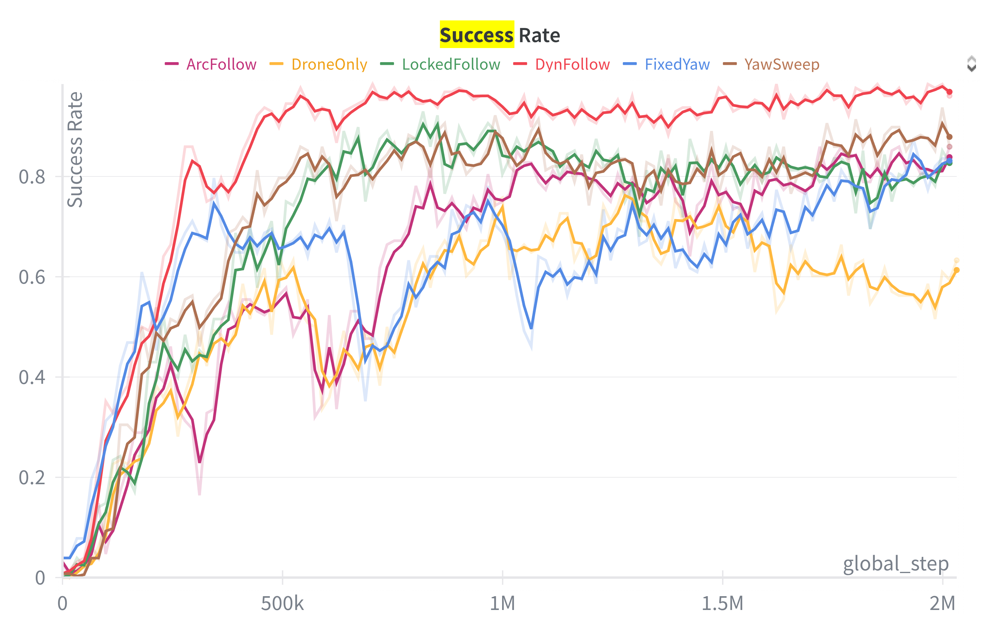
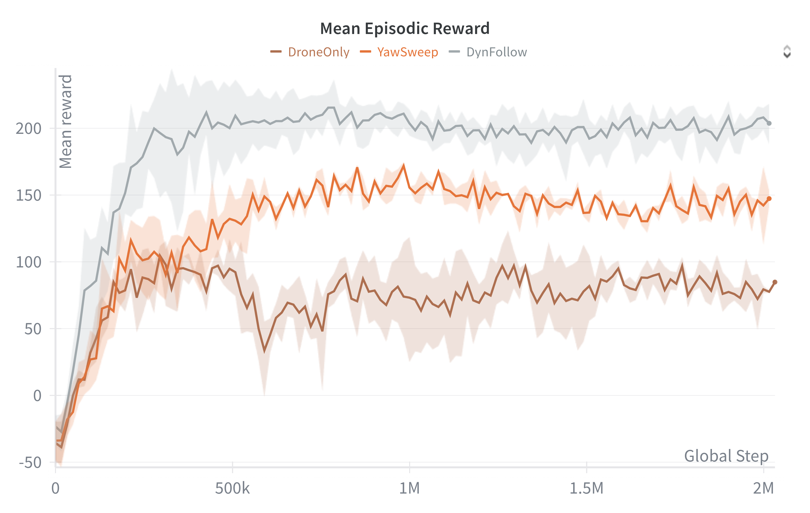
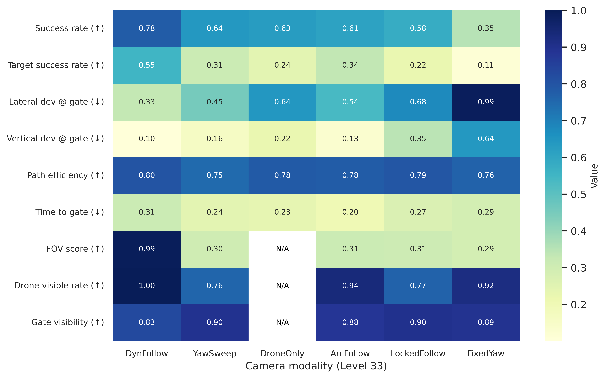

# Results Summary

> Key findings from Chapter 6 of: Z. Ruso, *"Reinforcement Learning for Cooperative Multi-View Depth-Based Perception in Autonomous UAV Navigation,"* MSc Thesis, UCL, 2025.

*Figure 6a: Training results — success rate progression across camera modes.*

*Figure 6b: Evaluation results — performance comparison across difficulty levels and camera modes.*

*Figure 6c: Cross-mode comparison of key metrics.*

## Key Findings

### RQ1: Does a second viewpoint improve navigation?

**Yes.** At the held-out Level 33 (unseen, harder than training):

| Configuration | Success Rate | Target SR (+/-10%) | Lateral Dev (m) | Vertical Dev (m) |
|--------------|-------------|-------------------|-----------------|-------------------|
| **Dual-view (best)** | **77.9%** [76.3, 79.5] | **0.551** | **0.33** | **0.10** |
| Drone-only baseline | 63.4% [61.5, 65.2] | 0.243 | 0.64 | 0.22 |

- Timeouts reduced from 17.8% to 5.7%
- Crashes reduced from 18.8% to 16.3%
- Dual-view improves both success rate and geometric precision at the gate

### RQ2: Does multi-view improve efficiency and accuracy?

**Yes.** At Level 33:

| Metric | Dual-view (DynFollow) | Drone-only |
|--------|----------------------|------------|
| Alignment | 0.94 | 0.86 |
| Path efficiency | 0.80 | 0.78 |

The added viewpoint produces more accurate, deliberate passages without incurring excessive detours.

### RQ3: Which camera behavior works best?

**DynFollow (dynamic drone-following)** was most robust at high difficulty. Performance at Level 33 by camera mode:

| Camera Mode | L33 Success Rate | Key Characteristic |
|-------------|-----------------|-------------------|
| **DynFollow** | **0.779** | Trails drone, biases toward gate when needed |
| YawSweep | 0.640 | Sinusoidal sweep; partial observability |
| ArcFollow | 0.614 | Circular arc around gate |
| LockedFollow | 0.580 | Fixed position, tracks drone orientation |
| FixedYaw | 0.353 | Fixed position, random fixed yaw per episode |

**Explanation:** Modes that kept the vehicle centered with sufficient gate context (high visible rate, small off-axis angles) minimized recurrent burden and reduced failures. Large sweeps or fixed orientations increased ambiguity and off-retina time.

### RQ4: Can exocentric-only control work?

**Yes, but dual-view is better.** Stream ablation at Level 33:

| Variant | Success | Target SR | Height Offset | Center Offset |
|---------|---------|-----------|---------------|---------------|
| **Dual (both cameras)** | **0.802** | **0.574** | **0.099** | **0.261** |
| Exocentric-only | 0.713 | 0.419 | 0.115 | 0.354 |
| Egocentric-only | 0.297 | 0.076 | 0.258 | 0.842 |

- Exocentric-only is viable (71.3% success) — the static camera provides sufficient global context
- Egocentric-only is markedly weaker (29.7%) — near-field occlusions and limited FOV are insufficient alone
- **Dual-view fusion yields additive gains** beyond either stream alone

### Noise Robustness

Asymmetric noise tests at Level 33 (one camera at L3 noise, other at L33 noise):

| Variant | Success |
|---------|---------|
| Dual (both noisy, L33) | 0.802 |
| Dual (clean drone, noisy static) | 0.774 |
| Dual (noisy drone, clean static) | 0.790 |

Performance did not exceed the symmetric baseline — the policy is robust to realistic corruption. The mild degradation indicates a small distribution-shift penalty when one stream becomes unrealistically clean, but dual fusion degrades gracefully.

## Training Progression

All six camera configurations were trained with identical budgets (2.01M frames, 128 envs) and curriculum (L13 start, promote to L23):

- All modes reached Level 23 during training
- DynFollow showed the fastest and most stable curriculum progression
- FixedYaw was slowest to promote, reflecting the difficulty of learning from a static, potentially off-target view

## Fusion Behavior

Gradient attribution analysis revealed:

- The policy **leans exocentric** (higher gradient share for static camera latents) but still benefits from complementary onboard details
- Gated fusion dynamically shifts reliance based on approach phase:
  - **Far from gate**: Static camera dominates (global context, corridor alignment)
  - **Near gate**: Onboard camera gains influence (fine edge cues, last-meter precision)
- Per-feature gating (64D) outperforms scalar gating (1D) by allowing heterogeneous informativeness across latent dimensions

## Limitations of Results

- **Simulation-only**: All results are from simulated environments with idealized sensor models
- **Single training seed**: Per-mode training used one seed; evaluation used five seeds for statistical power
- **Depth-only**: No RGB, no motion blur, no rolling shutter, no multipath
- **Static obstacles**: No dynamic moving objects
- **Synchronized cameras**: Zero-latency, perfectly synchronized feeds (unrealistic for real deployment)
- **Oracle exocentric placement**: Camera positions follow fixed geometric conventions
- **Level 33 is zero-shot**: Performance at L33 conflates difficulty with distribution shift (never seen during training)
