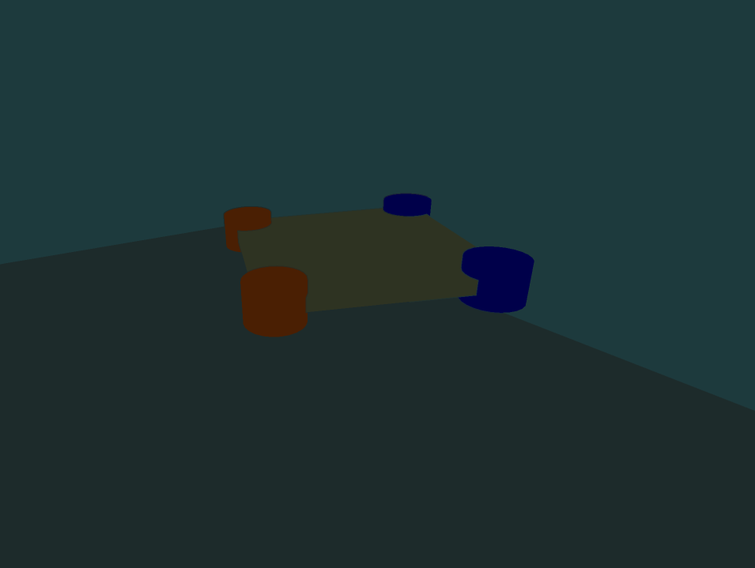
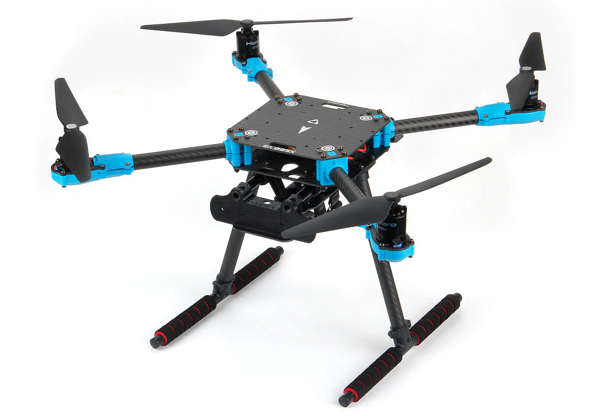

# Robot Platform & Control

> Detailed specification from Chapters 3.4 and Appendices B-D of: Z. Ruso, *"Reinforcement Learning for Cooperative Multi-View Depth-Based Perception in Autonomous UAV Navigation,"* MSc Thesis, UCL, 2025.

 
*Figure 3.5: X500 quadrotor — simulated gate-navigation view (left) and the physical X500 platform (right).*

## X500 Quadrotor Platform

The simulated airframe is a four-rotor quadrotor in an X-configuration, sized to traverse a rectangular gate with width ~2.5 m and height ~2.3 m. The form factor matches widely used research platforms (the physical X500) and keeps the rotor disk outside aperture margins at typical approach attitudes.

### Physical Properties

| Category | Parameter | Value | Notes |
|----------|-----------|-------|-------|
| **Configuration** | Rotor layout | X-configuration | 4 rotors |
| **Links** | Collapse fixed joints | True | Single base link for dynamics |
| **Links** | Fix base link | False | Free-flying |
| **Collision** | Self-collision | Disabled | Physically irrelevant for task |
| **Collision** | Rotor disks | Non-colliding | Excluded from collision geometry |
| **Solver** | Density regularization | 1.0e-6 | Solver stability guard |
| **Solver** | Armature | 1.0e-5 | Numerical regularization |
| **Limits** | Max linear velocity | 100.0 m/s | Hard safety cap |
| **Limits** | Max angular velocity | 100.0 rad/s | Hard safety cap |

### Instancing & Resets

- Airframe is preloaded once and reused across all vectorized environments
- Resets reinitialize vehicle state in-place to a hover-capable condition
- Per-environment buffers are cleared to prevent cross-episode leakage

## Motor Model

Rotor thrust is expressed in revolutions per second (rps) with quadratic scaling:

```
f_i = k_f * omega_i^2
```

| Parameter | Value | Units |
|-----------|-------|-------|
| Thrust coefficient k_f | 8.54858e-6 | N/(rps)^2 |
| Yaw torque coefficient c_tau | 0.025 | dimensionless |
| Per-motor thrust limits | [0.1, 20.0] | N |
| Thrust slew rate limit | 1e5 | N/s |

### Motor Dynamics

First-order response with **asymmetric rise/fall time constants** (faster spin-up than spin-down):

```
omega_i[t+1] = omega_i[t] + (dt / tau_i) * (omega_star_i[t] - omega_i[t])

tau_i = 0.0125 s   if omega_star > omega  (spin-up)
tau_i = 0.025  s   otherwise              (spin-down)
```

Where `omega_star = sqrt(f_star / k_f)` is the target rotor speed from allocation.

## Wrench Allocation (X-Configuration)

Non-negative rotor thrusts are mapped to the body wrench w = [F_z, M_x, M_y, M_z] via:

```
w = B * f

B = | 1    1    1    1  |
    | -l   l    l   -l  |
    | -l   l   -l    l  |
    | -c   c   -c    c  |
```

| Parameter | Value | Notes |
|-----------|-------|-------|
| Lever arm l | ~0.13 m | Rotor-to-center distance |
| Yaw-mix coefficient c | ~0.07 | Reaction torque coupling |
| Spin pattern | [1, -1, 1, -1] | CW/CCW alternation |

In batched runs, resultant-wrench mode is used (apply w directly at the base link for stability).

### Constrained Allocation

At each control period, a regularized box-constrained least-squares problem is solved:

```
min_{f >= 0}  0.5 * ||B*f - w||^2 + (lambda/2) * ||f - f_prev||^2
subject to:   f_min <= f <= f_max
              |f - f_prev| <= r_max * dt
```

When admissible, the closed-form interior solution `f* = B^T (B B^T)^{-1} w` is used; otherwise box/slew constraints are enforced with Tikhonov regularization.

## SE(3) Velocity-Yaw-Rate Controller

A geometric controller tracks body-frame velocity commands and yaw rate. Given:
- p, v: position/velocity in world W
- R in SO(3): attitude (body B -> world W)
- Omega: body angular rates

### Velocity Command Mapping

Policy output a in [-1, 1]^4 is linearly scaled:

| Axis | Command | Limit |
|------|---------|-------|
| X (forward) | v_cmd_x = 0.6 * a_x | 0.6 m/s |
| Y (lateral) | v_cmd_y = 0.6 * a_y | 0.6 m/s |
| Z (vertical) | v_cmd_z = 0.4 * a_z | 0.4 m/s |
| Yaw | psi_dot_cmd = 0.5 * a_psi | 0.5 rad/s |

### Controller Equations

Transform body commands to world frame: `v_cmd_W = R * v_cmd_B`

Velocity error: `e_v = v - v_cmd_W`

Desired acceleration (with gravity compensation):

```
a_d = -K_v * e_v + g * e_3
```

Desired thrust direction and magnitude:

```
b_3c = a_d / ||a_d||
f = m * a_d^T * (R * e_3)
```

Attitude error (on SO(3)):

```
e_R = 0.5 * (R_d^T * R - R^T * R_d)^vee
e_Omega = Omega - R^T * R_d * Omega_d
```

Torque command:

```
tau = -K_R * e_R - K_Omega * e_Omega + Omega x (J * Omega)
```

This formulation avoids singularities, cleanly separates thrust direction from yaw heading, and admits Lyapunov stability analysis.

## Exogenous Disturbances

To support robustness analysis, stochastic force/torque disturbances are injected at the platform level:

| Parameter | Value | Notes |
|-----------|-------|-------|
| Trigger probability | 0.05 | Per-step Bernoulli |
| Max force [fx, fy, fz] | [4.75, 4.75, 4.75] N | Bounded wrench |
| Max torque [tau_x, tau_y, tau_z] | [0.03, 0.03, 0.03] Nm | Bounded wrench |
| Linear damping | 0.02 | Asset-level |
| Angular damping | 0.02 | Asset-level |

Disturbances are assumed rare and zero-mean so as not to bias long-horizon behavior.

## Spawn States

Positions are sampled from bounded intervals within the approach corridor:

| Component | Range | Units |
|-----------|-------|-------|
| X position ratio | [0.35, 0.65] of workspace | ~ [-1.2, +1.2] m from center |
| Y position ratio | [0.225, 0.275] of workspace | ~ [-2.2, -1.8] m (approach side) |
| Z position ratio | [0.35, 0.40] of workspace | ~ [1.4, 1.6] m altitude |
| Yaw | [-pi/4, +pi/4] | rad |
| Translational velocity | [-0.1, 0.1] m/s (xy), [-0.05, 0.05] m/s (z) | Near-hover |
| Angular rates | [-0.02, 0.02] rad/s (xy), [-0.05, 0.05] rad/s (z) | Near-zero |

These keep initial states within the approach corridor and yield comparable time-to-gate horizons across seeds.

## Limitations

- Aeroelastic and detailed aerodynamic models (propwash, blade flapping) are not modeled
- Rotor disks are non-colliding
- Regularization terms are tuned for numerical rather than physical fidelity
- These simplifications are appropriate for gate traversal in rigid-body simulation
